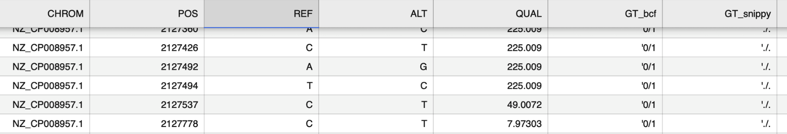
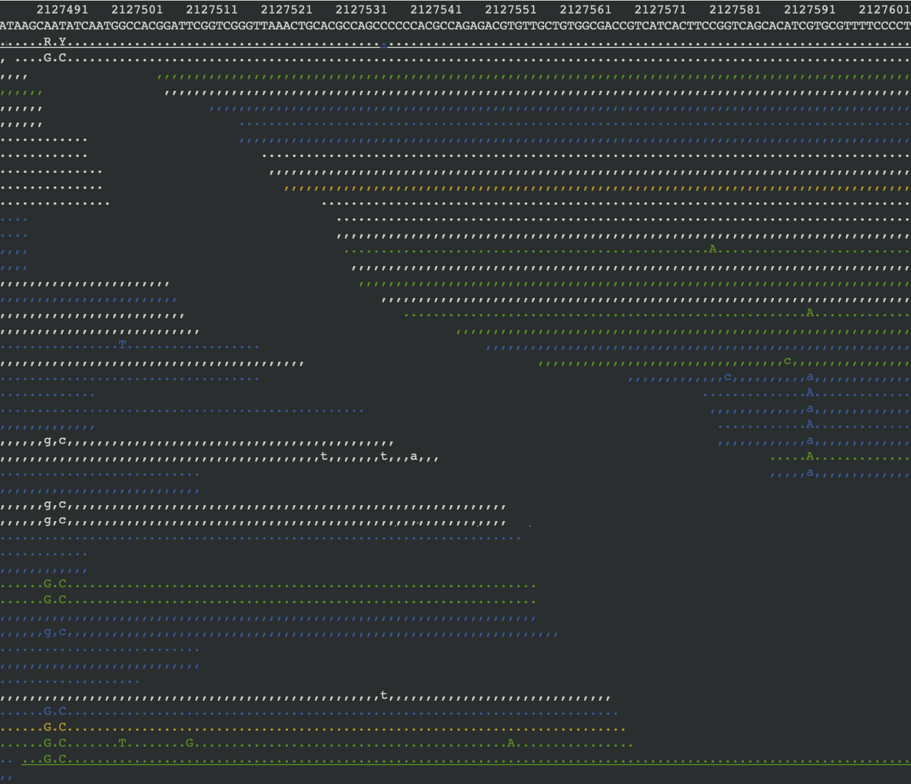
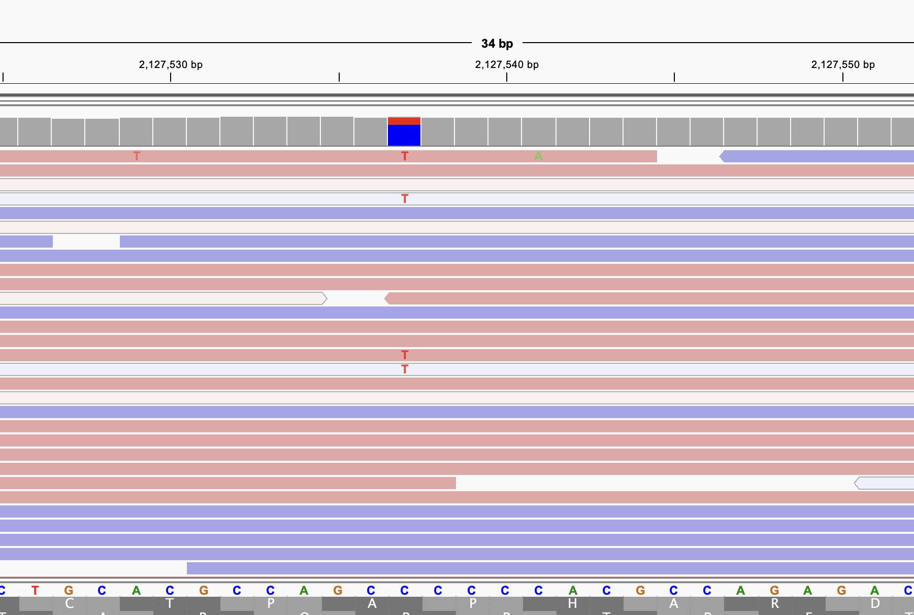

## Run the code on simulated mutated genome
Two variant callers were run on the simulated mutated genome and on the reads generated in part 1. The variants detected in the combined vcf files were then compared with those in `EcoliK12_simulated_mutation.csv`. The combined variant callers detected 319 variants, same as bcftools alone. Among the 20 simulated indels, only 4 were labelled as mismatch, which were due to differences in how the indels were recorded.

## Run the code on real data
In this section, _Escherichia coli O157:H7 str. EDL933_ were used as the reference genome for variant calling.A total of 1934 variants were recorded in the combined csv file, of which 1265 were not detected by snippy. This is mainly caused by different detection thresholds of two variant caller. bcftools is able to detect low-frequency variants low-support variants and hybrid variation, whereas snippy is more stringent and specially designed for bacterial epidemiology and evolutionary tree construction, and in my setting, it only recorded the variant with 90% allele frequency (`--minfrac 0.9`).

In the bcftools output, 935 variants have either a QUAL (quality score) below 20, or a GT been labelled as 0/1, both of which indicate non-confident variants. Figure 1 provides an example of the GT 0/1 call detected by bcftools, but absent from snippy, and Figure 2 shows the corresponding read evidence from tview. At position 2127492, the variant is recorded as _GT:PL:AD 0/1:255,0,202:30,34 ./.:.:._, demonstrating an approximately 50:50 ref:alt allele ratio. bcftools therefore reported it as a heterozygous, but snippy skipped it because bacteria are haploid and cannot biologically support heterozygous genotypes. On the other hand, the allele frequency of this variant is only 50%, which did not meet the 90% threshold of the snippy. At position 2127537 (Figure 1), the variant called by bcftools has low QUAL score, and supporting evidence is visible in tview (Figure 2) and IGV (Figure 3).

Figure 1. Example of the GT 0/1 in bcftools, and missing in snippy from the combination of vcf file.

Figure 2. The pileup evidence of Figure 1.

Figure 3. Example in IGV. The blue and red column is the reading position of 2127537, and the mapped reads have low variant frequency.

By viewing the mapping bam file in the IGV, there are big gaps, i.e, more than 1K bases length, of mapping can be observed (Figure 4). These gaps cannot be detected by the variant callers, so other tools will be applied to find out those gaps, such as bedtools.

Figure 4. Example of gaps found in IGV.

Overall, different variant callers are suited for different applications. In some cases, combining them can help detect variants present at lower frequencies and reduce the risk of missing potentially important mutations.
